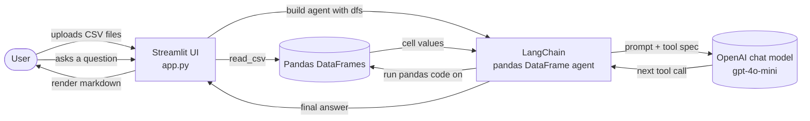
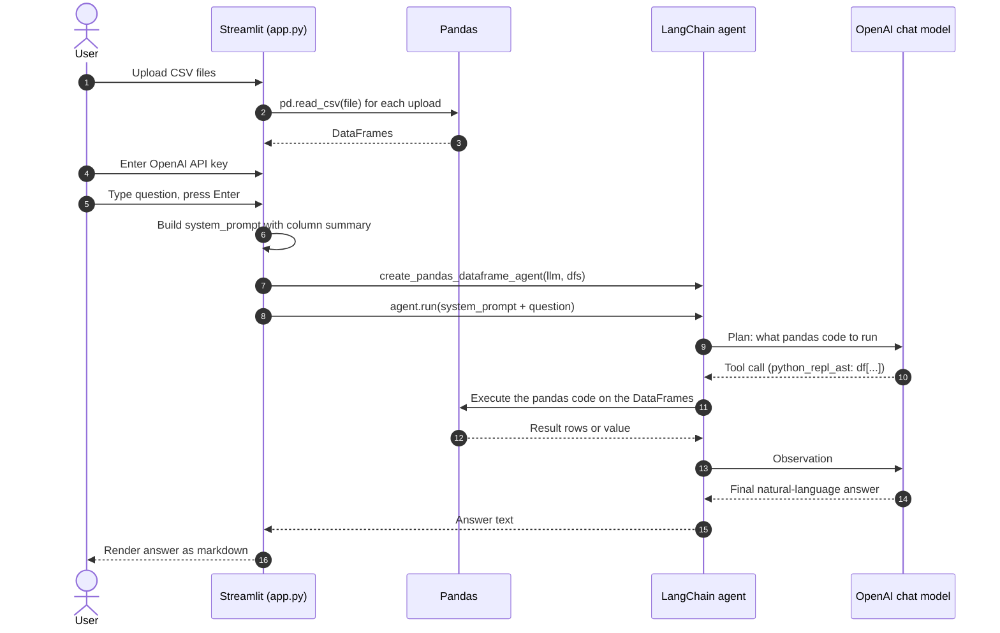

# Chat With Your CSV

> Ask plain-English questions about one or more CSV files and get answers grounded in the actual data, powered by Streamlit, LangChain, and an OpenAI chat model.


## Hero

Chat With Your CSV is a tiny, single-file web app that lets anyone upload a CSV (or several) and ask questions about the data in normal English. Instead of writing pandas code or building dashboards, you type a question such as "what is the return policy for electronics" and the app reads the rows that matter and reads them back to you. It is intentionally small (one Python file, around 150 lines) so the whole pattern of "LLM plus pandas plus Streamlit" can be understood end to end in one sitting, which makes it a good teaching project as well as a useful internal helper for FAQ-style CSV files.


## Table of Contents

1. [The Problem](#the-problem)
2. [The Solution](#the-solution)
3. [Who It Is For and Use Cases](#who-it-is-for-and-use-cases)
4. [Key Features](#key-features)
5. [Demo](#demo)
6. [Architecture](#architecture)
7. [Tech Stack](#tech-stack)
8. [Prerequisites](#prerequisites)
9. [Installation](#installation)
10. [Configuration](#configuration)
11. [Running the App](#running-the-app)
12. [Using the App Step by Step](#using-the-app-step-by-step)
13. [How `app.py` Works (Code Walkthrough)](#how-apppy-works-code-walkthrough)
14. [Sample CSV Files](#sample-csv-files)
15. [Customization](#customization)
16. [Troubleshooting](#troubleshooting)
17. [Project Structure](#project-structure)
18. [Security Notes](#security-notes)
19. [Contributing](#contributing)
20. [License](#license)
21. [Acknowledgments](#acknowledgments)


## The Problem

Teams sit on CSV files everywhere. Customer-service FAQs, hospital policies, credit-card terms, SaaS feature matrices, HR rules, sales exports, internal knowledge dumps. Whenever someone needs an answer that lives in those files, one of three painful things happens:

- A non-technical person opens the file in Excel and scrolls, filters, hunts for keywords, and often gives up or guesses.
- They ping a colleague who knows pandas or SQL, and the colleague stops their work to write a quick query.
- An organization invests in a heavyweight RAG pipeline (vector store, embeddings, chunking, retriever, prompt template, evaluation) just to answer the same kind of question they could have read straight from a row.

All three are slow. The first two do not scale beyond a handful of people. The third is expensive to build, expensive to run, and overkill for tabular data that already has structure. The real underlying gap is much simpler: it is easy for a human to phrase a question and hard for a human to navigate a spreadsheet, while it is the exact opposite for code. Nobody is bridging the two for small datasets.


## The Solution

Chat With Your CSV bridges that gap with the smallest possible stack:

| Pain point in the Problem section                          | What the app does about it                                                                                                              |
| ---------------------------------------------------------- | --------------------------------------------------------------------------------------------------------------------------------------- |
| Non-technical users cannot navigate CSVs efficiently       | A web UI accepts plain-English questions. No filter dropdowns, no syntax to learn.                                                      |
| Pandas-savvy colleagues become a bottleneck                | A LangChain pandas DataFrame agent writes and runs the pandas code on demand, so a human is no longer in the loop for each lookup.      |
| A full RAG stack is too heavy for small structured data    | There is no vector store and no retriever. The agent inspects the DataFrame directly. The whole app is one file.                        |
| Models hallucinate when asked about specific cell content  | A strict system prompt forbids guessing and forces the model to read the DataFrame, then quote actual values from the matching rows.    |

Before: a user opens `ecommerce_faqs.csv` in Excel, scrolls 200 rows, gives up.
After: the user types "what is the return policy for electronics", and the app reads the answer out of row 102 and shows it back, verbatim.


## Who It Is For and Use Cases

The project pays off any time the answers to common questions already live in a small CSV file and the people who need those answers are not pandas users. Three concrete scenarios:

### 1. Customer support agent searching FAQs
- **Persona:** Tier-one customer-support agent at an ecommerce company.
- **Situation:** A customer asks about return windows for electronics versus clothing during a live chat. The agent has an `ecommerce_faqs.csv` with 200 entries.
- **Outcome:** The agent uploads the CSV once, then types "what is the return policy for electronics" and gets the policy text from the right row in under two seconds, without alt-tabbing through a knowledge base.

### 2. Hospital ward clerk checking policy
- **Persona:** Ward clerk on night shift.
- **Situation:** A visitor wants to bring a child under 12 into the ICU. The clerk does not remember the exact rule and the policy binder is in another room.
- **Outcome:** With `hospital_policy.csv` already uploaded on the desk terminal, the clerk types "are children allowed in the ICU" and the app returns the exact policy line ("Children under 12 are not permitted in ICU or infectious disease wards") from row HP-001.

### 3. Solutions engineer answering API quota questions
- **Persona:** Solutions engineer at a SaaS company.
- **Situation:** A prospect on a sales call asks about rate limits and export formats. The engineer has `saas_docs.csv` with the whole feature matrix.
- **Outcome:** The engineer types "what are the rate limits for the Enterprise plan" and "in which formats can data be exported" while still on the call, and reads each answer straight from the CSV without context-switching to docs.

### 4. (Bonus) Self-learner exploring LangChain agents
- **Persona:** Engineer new to LLM tooling.
- **Situation:** They want to see how a "tool-using" agent actually wires together without a heavy RAG stack getting in the way.
- **Outcome:** They read `app.py` end to end in one sitting, then change the system prompt or swap the model and watch behavior change. This is the use case the project was originally built for.


## Key Features

User facing:

- Upload one or many CSV files at once through a simple drag-and-drop area.
- See a three-row preview of each file so you know it loaded correctly.
- Ask questions in plain English. Text questions ("what is the return policy"), numeric questions ("total fee for foreign transactions"), or filter questions ("show all delayed shipments") all work.
- Answers are grounded in actual cell values, not the model's general knowledge.
- Works with FAQs, policy documents, feature matrices, term lists, and other CSV-shaped reference data.

Technical:

- Single-file Streamlit app, around 150 lines of Python.
- LangChain `create_pandas_dataframe_agent` with the OpenAI functions agent style.
- Strict system prompt that forbids guessing and forces the agent to use pandas operations on the loaded DataFrames.
- Configurable OpenAI model (default `gpt-4o-mini`). Temperature is set to 0 for reproducible answers.
- Runs locally with `streamlit run app.py` or in a container via the included `Dockerfile`.
- MIT licensed.

What this project intentionally does not include:

- No vector store, embeddings, or RAG pipeline.
- No database. The CSVs you upload are read into pandas DataFrames and held in the running Streamlit session.
- No authentication. It is meant to run on your machine.


## Demo

The app has a small, deliberate UI. A sketch of the layout:

```
+----------------------------+----------------------------------------------------+
|  [icon]                    |                                                    |
|  Configuration             |       Chat with your CSVs (natural language)      |
|                            |                                                    |
|  OpenAI API Key            |   Upload CSV files and ask questions in normal     |
|  [********************]    |   language. The AI will look inside the tables     |
|                            |   and answer using the actual data.                |
|  --------------------      |                                                    |
|  Technology Stack          |   [ Drag and drop CSV files here   |  Browse   ]   |
|   - Streamlit              |                                                    |
|   - LangChain              |   Loaded 2 CSV file(s):                            |
|   - OpenAI                 |   +------------------+  +------------------+       |
|                            |   | ecommerce_faqs   |  | hospital_policy  |       |
|  Instructions              |   |  preview rows... |  |  preview rows... |       |
|   - Upload one or more     |   +------------------+  +------------------+       |
|     CSV files.             |                                                    |
|   - Ask in normal          |   Ask a question in normal language                |
|     language, e.g.:        |   [ what is the return policy for electronics ]    |
|     "what is the           |                                                    |
|      return policy"        |   AI Response:                                     |
|                            |   Electronics can be returned within 30 days of    |
|                            |   receipt. The item must be in original packaging  |
|                            |   with all accessories. A 15% restocking fee       |
|                            |   applies if the seal is broken.                   |
+----------------------------+----------------------------------------------------+
```

Example questions you can try with the bundled sample CSVs:

- `what is the return policy for electronics` (ecommerce_faqs.csv)
- `what is the foreign transaction fee` (credit_card_terms.csv)
- `are children allowed in the ICU` (hospital_policy.csv)
- `what are the rate limits for the free plan` (saas_docs.csv)
- `which user roles can edit projects` (saas_docs.csv)


## Architecture

The app is one Streamlit page that builds a LangChain agent over the uploaded DataFrames. The agent uses an OpenAI chat model to plan, executes pandas code on the user's behalf, and returns a natural-language answer grounded in the data.

High level data flow:



What happens on a single question:



A deeper walk-through with a "what lives where" map of `app.py` line ranges is in [`docs/architecture.md`](docs/architecture.md).


## Tech Stack

| Layer            | Tool                                                     | Why it is here                                                              |
| ---------------- | -------------------------------------------------------- | --------------------------------------------------------------------------- |
| UI               | [Streamlit](https://streamlit.io)                        | Zero-boilerplate web app. One file, top to bottom.                          |
| Data             | [pandas](https://pandas.pydata.org)                      | The CSVs become DataFrames. Familiar API for the agent's tool.              |
| Agent framework  | [LangChain](https://www.langchain.com)                   | `create_pandas_dataframe_agent` wires the LLM to a Python REPL over pandas. |
| LLM              | OpenAI `gpt-4o-mini` via `langchain-openai`              | Cheap, fast, more than capable for short tabular questions.                 |
| Output polish    | [tabulate](https://pypi.org/project/tabulate/)           | Pulled in transitively so pandas can pretty-print tables in agent output.    |

The exact packages live in [`requirements.txt`](requirements.txt).


## Prerequisites

- **Python 3.11 or later.** Tested with 3.11 and 3.12. The included `Dockerfile` uses `python:3.12-slim`. The Python 3.13 line in the original README is aspirational and not enforced.
- **pip** (ships with Python).
- **An OpenAI API key.** Create one at https://platform.openai.com/api-keys. Usage with `gpt-4o-mini` is inexpensive for this app (each question is typically a few thousand tokens including tool round trips).
- **About 200 MB of disk** for the Python virtual environment with all dependencies installed.

You do not need a database, a vector store, Docker, Node, or any cloud account beyond OpenAI.


## Installation

### Option A: Local virtual environment

```bash
# 1. Clone
git clone https://github.com/ANI-IN/Hello-Agent.git
cd Hello-Agent

# 2. Create a virtual environment
python -m venv venv

# 3. Activate it
source venv/bin/activate          # macOS or Linux
# venv\Scripts\activate            # Windows

# 4. Install dependencies
pip install -r requirements.txt
```

### Option B: Docker

```bash
docker build -t chat-with-csv .
docker run --rm -p 8501:8501 -e OPENAI_API_KEY=sk-your-key chat-with-csv
```

The image installs the same `requirements.txt` and copies `app.py` and the sample CSVs in. Streamlit listens on port 8501 inside the container.


## Configuration

There are two ways to provide your OpenAI API key. Pick whichever you prefer.

### 1. Sidebar text input (default)

Start the app and paste your key into the "OpenAI API Key" field in the sidebar. The field is masked. The key stays in memory for the life of the Streamlit session and is sent only to OpenAI's API over HTTPS by the LangChain client.

This is what `app.py` does today (see lines 14 to 18). It is the simplest path and is good for local use.

### 2. Environment variable (recommended for repeat use)

Copy the included template:

```bash
cp .env.example .env
# then edit .env and set OPENAI_API_KEY=sk-...
```

`.env` is excluded by `.gitignore` so it cannot be accidentally committed. To use it with the current `app.py`, export the variable in your shell before running:

```bash
export $(grep -v '^#' .env | xargs)
streamlit run app.py
```

LangChain's `ChatOpenAI` will pick the key up from the environment if you leave the sidebar field blank (you can confirm by typing nothing in the sidebar and uploading a file; if the env var is set the app proceeds, otherwise it asks).

### Other knobs

| Setting              | Where to change it                                       | Default          |
| -------------------- | -------------------------------------------------------- | ---------------- |
| Model                | `app.py` line 108 (`model="gpt-4o-mini"`)                | `gpt-4o-mini`    |
| Temperature          | `app.py` line 107 (`temperature=0.0`)                    | `0.0`            |
| Verbose agent logs   | `app.py` line 115 (`verbose=True`)                       | `True`           |
| Streamlit port       | command-line flag `--server.port`                        | `8501`           |
| Max upload size      | Streamlit option `server.maxUploadSize` in MB            | `200` (Streamlit default) |


## Running the App

With the virtual environment active and dependencies installed:

```bash
streamlit run app.py
```

Streamlit prints two URLs:

```
  Local URL: http://localhost:8501
  Network URL: http://192.168.x.x:8501
```

Open the Local URL in your browser. Do not share the Network URL on an untrusted network without reading the [Security Notes](#security-notes) below.


## Using the App Step by Step

1. Start the app with `streamlit run app.py`.
2. In the left sidebar, paste your OpenAI API key (or set `OPENAI_API_KEY` in the environment and leave the field empty).
3. Drag and drop one or more CSV files into the upload area in the main pane. The bundled sample files are a good place to start.
4. Check the preview tables to confirm the data loaded correctly.
5. Scroll down to the question box.
6. Type a question in normal language. Examples:
   - "what is the return policy for electronics"
   - "how long does standard shipping take"
   - "what does the extended warranty cover"
   - "list every fee in the credit card terms over $40"
7. Press Enter.
8. Wait for the spinner to finish. Typical responses arrive in 2 to 6 seconds.
9. Read the answer under "AI Response".

If the question matches the data, the answer will quote actual cell values. If nothing matches, the agent will say so rather than make something up.


## How `app.py` Works (Code Walkthrough)

This section walks `app.py` top to bottom so you can read along.

### Page configuration

```python
st.set_page_config(page_title="Chat with CSV", page_icon=":bar_chart:", layout="wide")
```

Sets the browser tab title, the icon, and the wide layout for the Streamlit page. (See `app.py` line 7.)

### Sidebar

```python
with st.sidebar:
    st.image("https://cdn-icons-png.flaticon.com/512/2814/2814668.png", width=50)
    st.title("Configuration")
    openai_api_key = st.text_input("OpenAI API Key", type="password", help="...")
```

Renders a small icon, a title, the API key field, the stack description, and a short list of instructions. (Lines 10 to 32.)

### File uploader

```python
uploaded_files = st.file_uploader(
    "Upload CSV files",
    type=["csv"],
    accept_multiple_files=True,
)
```

Accepts any number of CSV files at once. Streamlit returns a list of `UploadedFile` objects. (Lines 42 to 46.)

### Loading the CSVs and previewing them

```python
for i, file in enumerate(uploaded_files):
    df = pd.read_csv(file)
    dfs.append(df)
    df_names.append(file.name)

    with cols[i % len(cols)]:
        st.write(f"**{file.name}**")
        st.dataframe(df.head(3))
```

Each file is read into a pandas DataFrame. The first three rows of each are shown side by side. (Lines 49 to 62.)

### Building the DataFrame summary

```python
summaries = []
for name, df in zip(df_names, dfs):
    cols_sample = [str(c) for c in df.columns[:15]]
    summaries.append(f"- File: '{name}' | Columns: {', '.join(cols_sample)}")
df_summary_text = "\n".join(summaries)
```

A compact summary that tells the model which file has which columns. It is injected into the system prompt. (Lines 65 to 69.)

### System prompt

The next block (lines 71 to 102) builds the strict instructions the model is given. The important parts:

- "You MUST always inspect the DataFrames using Python / pandas before answering."
- "You are NOT allowed to answer from general knowledge or guesses."
- "For questions like 'what is the return policy' ... search through string columns and return the actual cell text."
- "For numeric questions ... use pandas operations on the numeric columns."

This is the soul of the project. Change this block and the behavior of the assistant changes immediately.

### LLM and agent

```python
llm = ChatOpenAI(
    temperature=0.0,
    model="gpt-4o-mini",
    openai_api_key=openai_api_key,
)
agent = create_pandas_dataframe_agent(
    llm,
    dfs,
    verbose=True,
    agent_type="openai-functions",
    allow_dangerous_code=True,
)
```

`ChatOpenAI` is the model client. `create_pandas_dataframe_agent` wraps it in an agent that has the DataFrames in scope and a Python REPL as its tool. (Lines 106 to 118.)

> **Heads up:** `allow_dangerous_code=True` is required by the pandas REPL tool. It also means the model can execute Python on your machine. Run this app on data and questions you trust. See [Security Notes](#security-notes).

### Asking and answering

```python
user_question = st.text_input("Example: 'what is the return policy', ...")
if user_question:
    final_query = (
        system_prompt
        + "\n\nNow answer this question using the DataFrames only:\n"
        + user_question
    )
    response = agent.run(final_query)
    st.markdown(response)
```

The question is prepended with the system prompt and handed to the agent. The agent loops with the model until it decides it has an answer, then returns plain text that is rendered as markdown. (Lines 121 to 143.)


## Sample CSV Files

Four small CSVs are included so you can try the app without bringing your own data. Each has 14 example rows.

| File                       | Domain                  | Key columns                                                          | Try asking                                                |
| -------------------------- | ----------------------- | -------------------------------------------------------------------- | --------------------------------------------------------- |
| `credit_card_terms.csv`    | Banking, card terms     | Term ID, Card Type, Category, Detail Text, Variable Rate, Fee Amount | "what is the foreign transaction fee"                     |
| `ecommerce_faqs.csv`       | Retail, customer FAQs   | ID, Category, Question, Answer, Related Products, Last Updated       | "what is the return policy for electronics"               |
| `hospital_policy.csv`      | Healthcare policy       | Policy ID, Department, Topic, Policy Text, Effective Date, Compliance Level | "are children allowed in the ICU"                  |
| `saas_docs.csv`            | SaaS product reference  | Doc ID, Feature, Plan Level, Description, Technical Limit, Related API | "what are the rate limits for the free plan"            |

You can add your own CSV anywhere in the project folder (or just upload it directly through the UI). The agent does not care about file names or schemas as long as the data is tabular.


## Customization

The whole project is one file, so customizing it is mostly editing `app.py`. Common changes:

- **Swap the model.** Change `model="gpt-4o-mini"` to `gpt-4o`, `gpt-4-turbo`, or any other supported chat model on line 108.
- **Tighten or loosen the system prompt.** Edit the block at lines 71 to 102 to control how the assistant answers. For example, ask it to always return answers in bullet points, or in a specific language.
- **Restrict the agent's tools.** If you do not want the agent to run arbitrary Python, replace `create_pandas_dataframe_agent` with your own tools (a fuzzy-search tool plus an aggregate tool, for example). See [Security Notes](#security-notes).
- **Add a question history.** Store questions and answers in `st.session_state` and render with `st.chat_message`.
- **Default to a folder of CSVs.** Skip the uploader and load every `*.csv` from a known directory at startup, so users do not have to upload anything.
- **Theme it.** Streamlit has a config file (`.streamlit/config.toml`) where you can set colors and fonts.


## Troubleshooting

### "Please enter your OpenAI API Key in the sidebar to proceed."
The app is waiting for a key. Either paste one into the sidebar or set `OPENAI_API_KEY` in your environment before running.

### "Please upload your CSV files to start."
The key is set, but no files are uploaded. Drag a CSV into the upload area.

### `openai.AuthenticationError: Incorrect API key`
The key is wrong, expired, or missing access to `gpt-4o-mini`. Generate a fresh key and try again.

### `pandas.errors.ParserError` after uploading
The CSV is malformed (mismatched quoting, mixed delimiters). Open the file and confirm it parses with `pd.read_csv(...)` outside the app first. Some exports from Excel use semicolons; convert to comma-delimited before uploading.

### The model answers with a generic statement instead of quoting cells
This sometimes happens with very wide CSVs (more than 15 columns), because the app only sends the first 15 column names in the system prompt. Either reorder your columns so the relevant ones are first, or edit `app.py` line 67 to send all columns.

### "ValueError: I/O operation on closed file"
Streamlit's uploaded-file objects are streams. If the script reruns mid-read, this error can appear. Reload the page and re-upload.

### Streamlit complains about port 8501 being in use
Another Streamlit process is running. Stop it, or pass `--server.port 8502` to the run command.

### The container exits immediately
You probably forgot to pass the API key. Use `docker run -e OPENAI_API_KEY=sk-... ...`. If the key is correct and it still exits, run with `-it` to see the error.


## Project Structure

```
Hello-Agent/
  app.py                       # the entire application
  requirements.txt             # Python dependencies
  Dockerfile                   # container build for `docker run`
  .env.example                 # template for the OPENAI_API_KEY environment variable
  .gitignore                   # excludes venv, .env, __pycache__, .streamlit/secrets.toml
  LICENSE                      # MIT
  README.md                    # this file
  SECURITY.md                  # how to report issues, trust model
  CONTRIBUTING.md              # how to set up and propose changes
  CODE_OF_CONDUCT.md           # community expectations
  docs/
    architecture.md            # deeper architecture write-up with mermaid diagrams
  credit_card_terms.csv        # sample CSV
  ecommerce_faqs.csv           # sample CSV
  hospital_policy.csv          # sample CSV
  saas_docs.csv                # sample CSV
```


## Security Notes

This section is a short summary of what is in [`SECURITY.md`](SECURITY.md). Please read that file before deploying the app.

- The pandas DataFrame agent uses `allow_dangerous_code=True`, which means the LLM can execute arbitrary Python on your machine. Run the app on local, trusted data only.
- The OpenAI API key is held in the Streamlit session. Do not paste it on a shared machine. Prefer the environment variable.
- CSV cell text is read by the model. A malicious CSV can carry instructions aimed at the model. For a teaching project this is acceptable. For production, sandbox the agent or restrict its toolset.
- Dependencies in `requirements.txt` are not pinned. For reproducible installs, generate a lock file with `pip-compile`.

To report a security issue privately, follow the steps in [`SECURITY.md`](SECURITY.md).


## Contributing

Contributions are welcome, especially ones that keep the project small and clear. The full guide is in [`CONTRIBUTING.md`](CONTRIBUTING.md). In short:

1. Open an issue first if the change is non-trivial.
2. Fork, branch from `main`, keep one logical change per pull request.
3. Run `streamlit run app.py` locally with at least one sample CSV before opening the PR.
4. Stick to PEP 8. `black .` is fine to use.
5. Use plain ASCII punctuation. No smart quotes, no long dashes.

Everyone who participates in this project is expected to follow the [`CODE_OF_CONDUCT.md`](CODE_OF_CONDUCT.md).


## License

This project is licensed under the MIT License. See [`LICENSE`](LICENSE) for the full text.


## Acknowledgments

- [Streamlit](https://streamlit.io) for making Python web apps feel like writing a script.
- [LangChain](https://www.langchain.com) for the pandas DataFrame agent that does the heavy lifting.
- [OpenAI](https://openai.com) for the underlying chat model.
- The sample CSVs are fully synthetic and were written by the project author to be representative of common FAQ-style data without any real personal or company information.

If you build something interesting on top of this project, open an issue and tell the maintainer about it.
