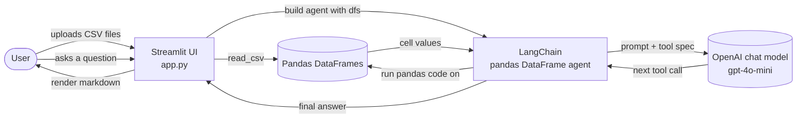
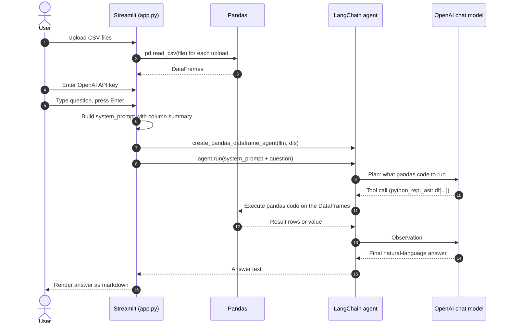

# Architecture

A short overview of how the Chat With Your CSV teaching app works under the hood. The whole app is a single file (`app.py`) and is meant to teach how a small LLM-powered data assistant is wired together.

## High level

The app is a Streamlit web UI that hands uploaded CSV files to a LangChain pandas DataFrame agent. The agent uses an OpenAI chat model to plan, executes pandas code on the user's behalf, and returns the answer as plain text.

## Request lifecycle

The diagram below traces what happens when a user types a question and presses Enter.

## What lives where

| Piece                       | Where it is in `app.py` | Job                                                                 |
| --------------------------- | ----------------------- | ------------------------------------------------------------------- |
| Page configuration          | lines 7                 | Sets the title, icon, and wide layout                               |
| Sidebar                     | lines 10 to 32          | Collects the OpenAI API key and shows instructions                  |
| File uploader               | lines 42 to 46          | Accepts one or more CSV files                                       |
| CSV loading and preview     | lines 49 to 62          | Reads each CSV into a DataFrame and shows the first three rows      |
| DataFrame summary builder   | lines 65 to 69          | Lists each file with up to 15 of its column names                   |
| System prompt               | lines 71 to 102         | Strict rules that tell the model to read the DataFrames, not guess  |
| LLM client and agent        | lines 106 to 118        | Builds the OpenAI client and the pandas DataFrame agent             |
| Question input and answer   | lines 121 to 143        | Takes the question, prepends the system prompt, calls the agent     |

## Key design choices

- One file, no folders for source. The whole app is `app.py` so a learner can read it top to bottom in one sitting.
- No vector store. This is intentionally not a RAG project. The pandas agent inspects the DataFrames directly, which keeps the moving parts to a minimum.
- The system prompt is a single, opinionated block. It tells the model: always read the data, never guess, return the actual cell values.
- The agent uses `agent_type="openai-functions"` so the LLM emits structured tool calls instead of free-form text. This makes the pandas-tool calls more reliable.
- `allow_dangerous_code=True` is set because the LangChain pandas agent's Python tool requires it. For a real deployment this should be revisited (see the security notes in the project README).

## Trust boundaries (read before deploying)

- The OpenAI API key is read from the sidebar text input. It lives in the Streamlit session and is sent to OpenAI over HTTPS by the LangChain client. Do not paste it on a shared machine.
- The pandas agent executes Python code that the LLM emits. With `allow_dangerous_code=True`, that code runs with the same permissions as the Streamlit process. The teaching app is meant for local use on data you trust. Treat any deployment beyond localhost as needing additional sandboxing.
- CSV cells are passed to the model as text. A CSV from an untrusted source can carry instructions aimed at the model. For a teaching project this is acceptable. For production, consider stripping or escaping instruction-like cell content.

## Glossary

- **DataFrame**: a table in pandas. Each uploaded CSV becomes one DataFrame.
- **Agent**: a small program (here, built by LangChain) that asks the LLM what to do next and then runs that step. It loops until the LLM says it is done.
- **Tool**: a function the agent can call. The pandas DataFrame agent gives the LLM one tool: a Python REPL with the DataFrames already in scope.
- **System prompt**: the instructions the model sees first. In this app, it tells the model how to use the DataFrames.
